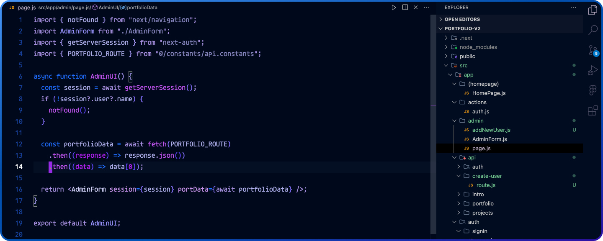
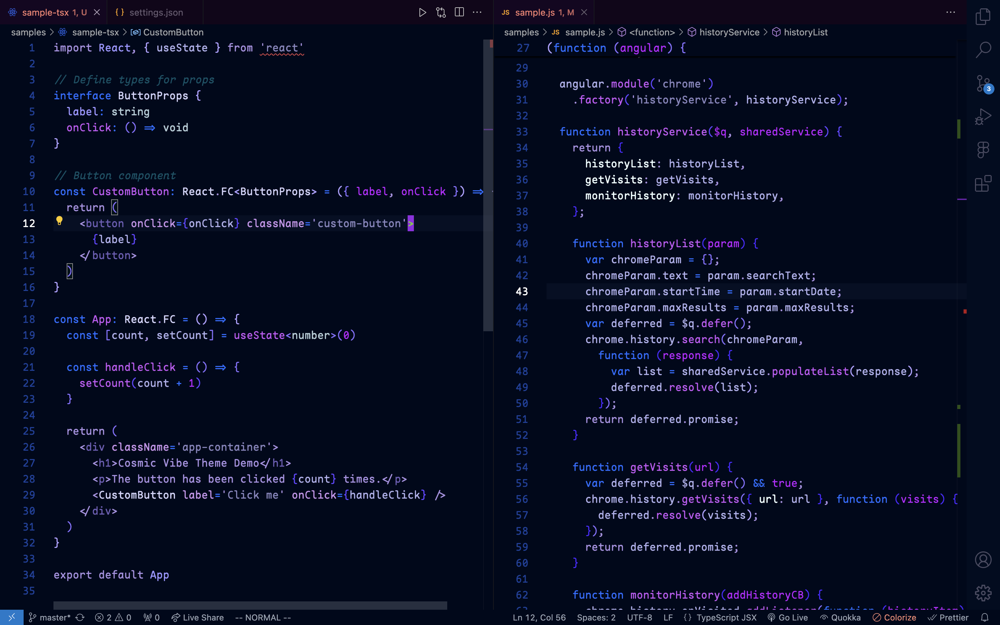
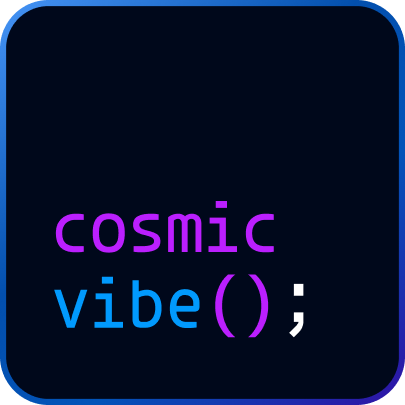

# Cosmic Vibe 🌌 - A Minimalist Blue Theme for VSCode

Cosmic Vibe is a carefully crafted VSCode theme that explores various shades of blue to create a clean, focused, and calming coding environment. Inspired by the depths of the cosmos, this theme is designed to provide a unique visual experience, allowing you to stay productive while immersing yourself in a cool, soothing aesthetic.

## Features ✨
- **Blue Hues Only**: A palette focused entirely on different shades of blue for a cohesive, clean look.
- **Minimalist Design**: No distractions. Pure focus.
- **Readable Contrast**: Carefully chosen shades to ensure great readability and maintain long coding sessions.
- **Consistent Color Mapping**: Syntax highlighting for keywords, variables, types, and comments is optimized for clarity and consistency.
  
## Perfect For:
- Developers who love a clean, calm coding experience.
- Those who want a unified theme based around shades of blue.
- Anyone looking to reduce eye strain without sacrificing readability.

## Screenshots

## Installation

1. Open VSCode.
2. Go to the Extensions view by clicking on the Extensions icon in the Sidebar or using `Ctrl+Shift+X`.
3. Search for `Cosmic Vibe`.
4. Click **Install**.

Once installed, select the theme by going to the Command Palette (`Ctrl+Shift+P`) and typing `Preferences: Color Theme`, then choose **Cosmic Vibe**.

## Contributing 🤝
If you have suggestions for improvements, feel free to open an issue or a pull request! Your feedback is always welcome.

## License 📜
This theme is available under the [MIT License](./LICENSE).

## Download

This extension is available for free in the [Visual Studio Code Marketplace](https://marketplace.visualstudio.com/items/ni1in.vscode-cosmic-vibe)

## Customization

If you are using VSCode 1.12+ versions you can customize the colors to your liking, overriding the ones provided by this theme. More info [here](https://code.visualstudio.com/docs/getstarted/theme-color-reference).

### Custom Font

Font - Maple Mono, Agave Mono

